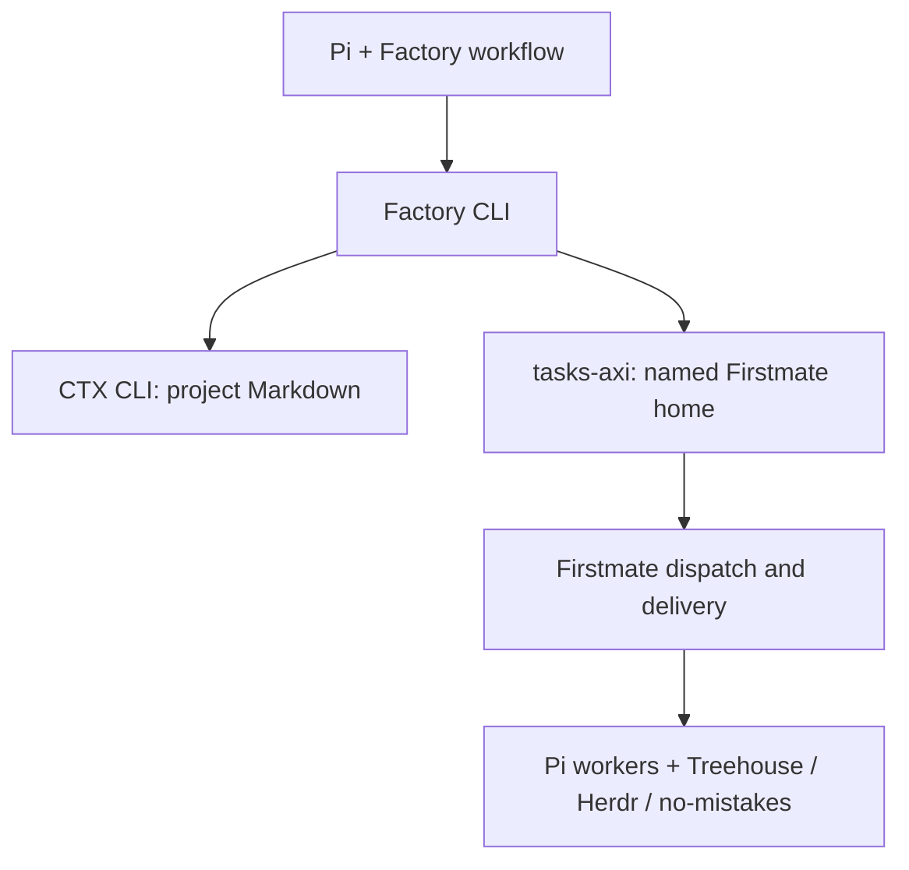

# Factory — architecture and implementation truth

## Boundary



The arrows indicate information flow, not automatic process control. Factory does not spawn or manage a worker. `sync --apply` publishes tasks; an operator or Firstmate itself decides when and how dispatch occurs. The Firstmate home is outside the target project repository. No Factory component modifies Firstmate's tracked code or changes a project's shipping mode.

## Source and runtime layout

```text
factory/
  README.md PROJECT.md ARCHITECTURE.md COMPLETION.md BUILD_PLAN.md AGENTS.md
  docs/{CONTRACTS,INTEGRATIONS,WORKFLOW,RESEARCH,BOOTSTRAP_PROMPTS}.md
  src/cli.ts
  src/core/{load,validate,graph,plan,context,evidence,status}.ts
  src/adapters/{ctx,tasks-axi,git,firstmate-home}.ts
  src/types.ts
  schemas/{project,task,completion,evidence}.schema.json
  test/{contracts,graph,context,sync,status,fixtures}/
  skills/factory/SKILL.md                 # created and validated at CP-04
  extensions/factory.ts                  # optional, created at CP-07
```

On a target project, tracked source lives in `.factory/project.yaml`, `.factory/tasks/*.yaml`, `.factory/completion.yaml`, and its ordinary product/architecture/decision Markdown. Generated output lives only under ignored `.factory/state/`. `factory init` creates the directories and an exact `.factory/state/` ignore rule if absent; it refuses to overwrite existing files or invent product contracts. A separate fixture contains complete sample contracts. No automatic CTX initialization or document addition occurs without an explicit operator action, because the authority set must be deliberate.

## CLI input and output

Every command accepts `--root <absolute-or-relative-project-root>`; resolve it once to a canonical Git repository path, then use it for all subordinate operations. `doctor`, `sync`, and `status` accept `--home <absolute-Firstmate-home>`; `doctor` also accepts `--ctx-bin` and `--tasks-bin` overrides for installations outside PATH, whose resolved paths can be stored in a local config for subsequent commands. All subprocesses use argument arrays, fixed working directories, bounded timeouts, captured stdout/stderr, and no shell interpolation. `--json` prints one versioned JSON object on stdout; diagnostics and progress go to stderr. Nonzero exits distinguish invalid input, integration unavailable, conflict, and internal error.

Recommended exit codes: `0` success; `2` validation failure; `3` unavailable/stale integration; `4` publication conflict; `1` other failure. Errors must be structured as `{schema_version:1, code, message, details}` in JSON mode. No command silently mutates the external backlog except `sync --apply`.

## Contracts and graph

`src/core/load.ts` reads only regular UTF-8 files beneath the canonical root, rejects symlink escapes, duplicate IDs, and unknown schema versions, and performs bounded size checks. `validate.ts` parses YAML with a safe parser (no custom tags), checks the JSON schema plus cross-file invariants. `graph.ts` verifies all dependencies exist, no self-edge or cycle, and at least one task is ready when tasks exist and no external decision blocks all roots. Acceptance items have stable IDs and each task states which project completion condition it advances. The exact contract is in `docs/CONTRACTS.md`.

## CTX context pack

`factory context TASK-ID` first includes the exact tracked task contract and a concise global project constraint section. It invokes `ctx status --root <root> --json` and `ctx doctor --offline --root <root> --json` as appropriate, then `ctx pack <query> --root <root> --token-budget <limit> --document <task-source>... --json`. The query is derived from title, outcome, acceptance, and topic strings; it is never a command. Repeated `--document` filters come from the task's declared `context.required` selection, so CTX ranks within task-local authority instead of adding unrelated corpus excerpts. When that valid selection is empty, Factory passes the project's mandatory `documents.required` paths instead; it never invokes `ctx pack` without a document filter, and a global-only task remains viable without widening to the corpus. Canonical required documents are read from their original files, checked against root containment, and admitted before CTX excerpts; declaring a source required never substitutes an excerpt for the exact original. The adapter records CTX generation, file and line provenance, and available hashes. On stale, missing, or insufficient retrieval, it returns `CONTEXT_BLOCKED` with an actionable diagnostic. It does not fill the pack with guessed material or hide post-retrieval excerpts to improve a relevance score.

Default total task-context budgets (including contract and mandatory material) are 4,000 tokens for bounded, 8,000 for normal, and 15,000 for critical; these are design defaults to measure, not promises that CTX necessarily returns that many tokens. Reserve space for task contract and required sources before calling CTX with the remainder. The adapter enforces a byte ceiling as well as CTX's token budget, deduplicates overlapping excerpts, and never truncates an authoritative requirement mid-sentence. The pack is written atomically to `.factory/state/context/TASK-ID.md` with a sidecar receipt containing contract digest, source digests, CTX generation, timestamp, and retrieval mode. A worker verifies these before trusting the pack; if changed, regenerate it.

CTX is allowed to use lexical fallback when explicitly reported and retrieval suffices for the task. A missing mandatory document or stale index blocks. No automatic network download or model initialization. Code discovery remains `rg`, compiler/LSP, and Git; CTX is for durable Markdown project knowledge.

## Safe publication

`factory sync --dry-run --home <home>` is read-only. It checks the Firstmate home is canonical and explicitly selected, the active project is registered there, the home uses a supported tasks-axi backend, and that the installed tools pass actual feature probes. It renders a deterministic diff of `create`, `unchanged`, `conflict`, and `blocked` records. There is no partial write in dry run.

`sync --apply` rechecks the same preconditions immediately before mutation. The source ID is the join key: `factory:<project-id>:<task-id>` encoded to the installed tasks-axi ID constraints discovered in CP-00. The backlog body begins with a stable Factory marker, project/repo identity, contract digest, brief and acceptance, dependency IDs, evidence expectations, and the relative path to the tracked task contract. It must remain understandable to a worker without access to Factory's local state. Publish in dependency order using tasks-axi's supported commands; do not edit `data/backlog.md` directly. For an existing matching item, leave it unchanged. If an existing ID has a different digest or a human edit, return a conflict; do not overwrite, reopen, move, or retitle it automatically. If any preflight would conflict, apply nothing. If an individual write fails after earlier writes, report `PARTIAL_SYNC` and list IDs; rerunning safely converges the remaining creates without changing prior matching records. Durable post-write reconciliation reads the actual backlog, not an optimistic local cache.

Treat the body file and command flags as implementation details to confirm in CP-00 against the installed tasks-axi version. In particular, a `tasks-axi` invocation must run in the effective Firstmate home with that home's `.tasks.toml`; the code checkout and home can differ. Do not assume a Firstmate `factory sync` API exists. Firstmate alone owns task state transitions and dispatch locks.

## Evidence and completion

The tracked `.factory/completion.yaml` is authored before task implementation. It names outcome IDs, executable checks or a manual observation protocol, and a source-of-truth artifact per check. A task evidence receipt binds task ID, contract digest, Git commit SHA, test command and exit code, artifact path/hash, reviewer disposition if required, and time. `factory evidence TASK-ID` validates and displays receipts; it cannot declare a passing test from a prose claim. Receipts refer to actual CI and no-mistakes evidence when available rather than duplicating their pipeline.

`factory status` reads tasks-axi, task evidence receipts, and completion receipts, reporting backlog progress, task evidence, and product behavior separately. A pass is stale when its tested commit is not the current release-candidate SHA or relevant contract has changed. The initial implementation may require an explicit `factory status --refresh` to execute project-level checks in a controlled project environment. An unmet condition means `NOT COMPLETE`, even if all backlog tasks are marked done; a new task is drafted or proposed through normal review, never created behind the user's back.

## Failures and trust boundaries

| Failure                                    | Required response                                                                                            |
| ------------------------------------------ | ------------------------------------------------------------------------------------------------------------ |
| CTX unavailable or index stale             | Do not make up context; exact required files still available for manual work; context command exits blocked. |
| Firstmate home absent or not registered    | Publication blocked; preview shows required setup.                                                           |
| tasks-axi CLI/version/backend incompatible | Publication blocked; no direct backlog file edit fallback.                                                   |
| Contract changed during sync               | Abort before writes where possible; report partial state if a write already occurred.                        |
| Duplicate ID/body edited by another actor  | Conflict, never clobber.                                                                                     |
| Source path outside repo or symlink escape | Reject before reading or publishing.                                                                         |
| Project checks pass on obsolete commit     | Mark stale; rerun against release candidate.                                                                 |
| Worker reports pass without evidence       | Show unverified, not complete.                                                                               |

External repository files, CTX excerpts, and task bodies are untrusted as shell commands. The CLI never executes test commands solely because a contract specifies one; allowed project checks are defined by a reviewed, tracked verification configuration and executed only by an explicit operator/worker command. Do not store secrets or raw agent transcripts in a context pack or receipt.
